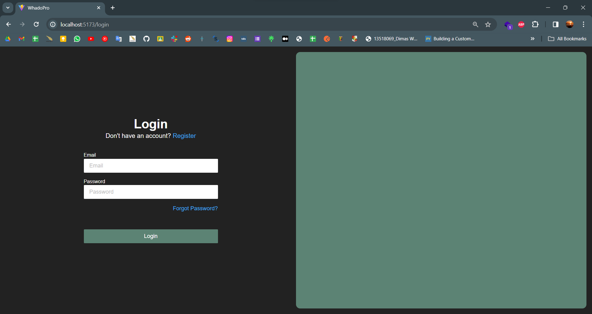
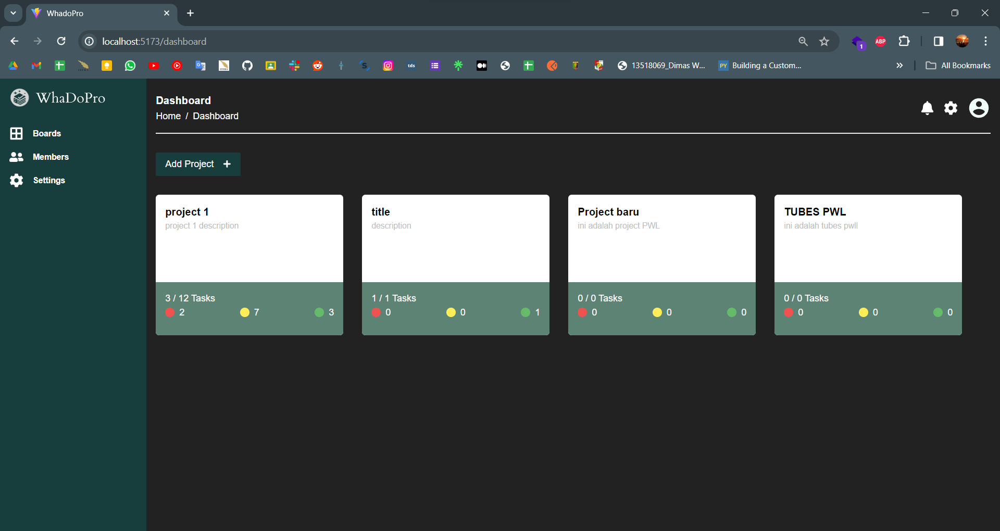
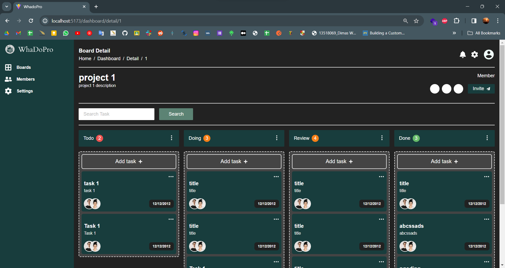

# Whadopro Frontend

## Tech Stack

- VITE
- React
- Typescript
- TailwindCSS
- React Router Dom
- React Hook Form
- Axios
- useSWR
- react-toastify
- React Auth Kit
- DndKit

## How to run

1. Clone this repository

```bash
git clone https://github.com/maybeenang/whadopro-frontent.git
```

2. Change directory to this repository

```bash
cd whadopro-frontend
```

3. Install dependencies

```bash
npm install
```

or

```bash
pnpm install
```

4. Run the app

```bash
npm run dev
```

## All done 🎉🎉🎉

## Screenshots





